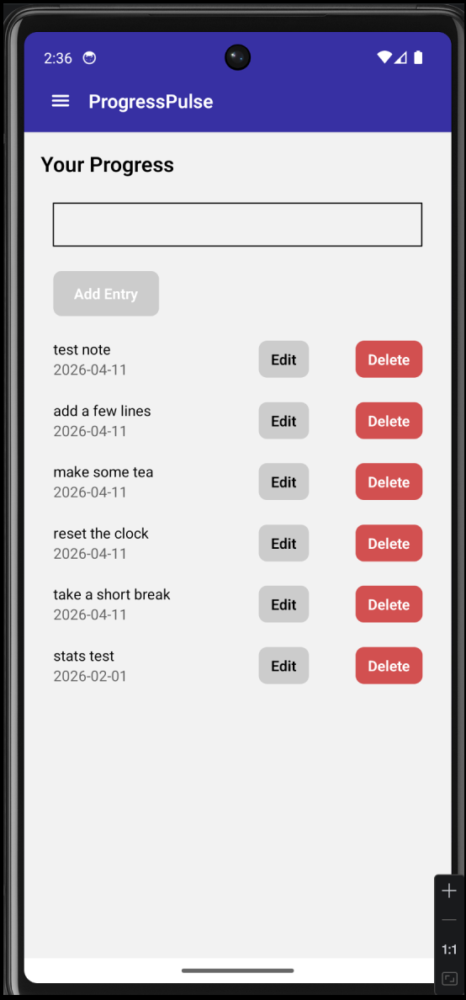
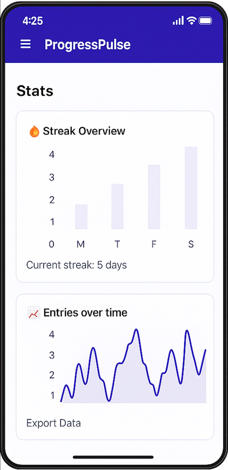
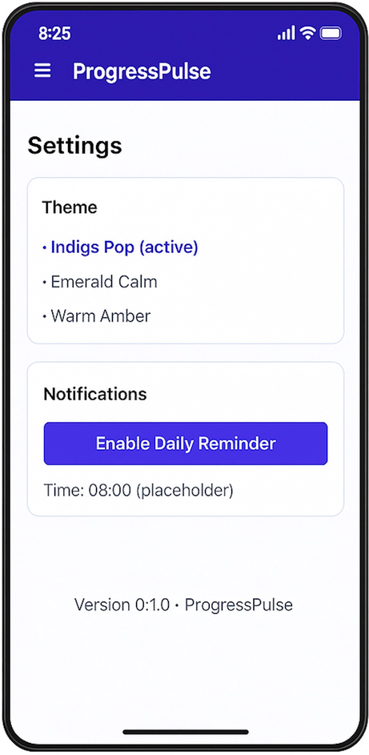

# 📱 ProgressPulse

**A minimalist, offline-first habit and learning tracker built with React Native and Expo.**  
Track your daily progress, maintain streaks, and visualize your growth — even when you’re offline.

---

## 🖼️ App Preview

<!-- <p align="center">
  
  
  
</p> -->

_(Screenshots from Android emulator — captured November 2025)_

---

## 🎯 Overview

ProgressPulse helps learners and professionals build consistency through daily updates.  
It focuses on simplicity and momentum — quick entries, clear streaks, and smart reminders.

### ✨ Key Features

- 🏠 **Home Dashboard** – view your latest progress and streaks
- ✍️ **Add / Edit / Delete Entries** – track what matters every day
- 💾 **Offline-first** – all data stored locally using SQLite
- 🔐 **Secure User ID** – handled via Expo SecureStore
- 🔔 **Notifications** _(coming soon)_ – gentle reminders to keep you consistent
- ☁️ **Cloud Sync (Planned)** – AWS Lambda + DynamoDB for multi-device use

---

## 🧱 Tech Stack

| Layer                  | Tools                                                    |
| ---------------------- | -------------------------------------------------------- |
| **Frontend**           | React Native · Expo · Expo Router · TypeScript           |
| **Storage**            | Expo SQLite (local) · Expo SecureStore                   |
| **Build & Deployment** | EAS Build · Android Studio                               |
| **Backend (Phase 2)**  | AWS Lambda · DynamoDB · API Gateway · Cognito (optional) |

---

## 📂 Project Structure

```
app/
  _layout.tsx          # header + navigation layout
  index.tsx            # Home screen
  entry/
    new.tsx            # New Entry screen
    [id].tsx           # Entry Detail screen
  stats.tsx            # Stats (upcoming)
  settings.tsx         # Settings (upcoming)

lib/
  colors.ts            # Shared theme colors
  entries.ts           # SQLite CRUD logic
  userId.ts            # Secure user ID generation
```

---

## 📸 Screens & Flow

**User Flow:**

1. Home →
2. Add Entry →
3. Save →
4. Return to Home →
5. View Entry →
6. Edit or Delete

**Screens Implemented (v0.1):**

- ✅ Home
- ✅ Add New Entry
- ✅ Entry Details
- ⏳ Stats
- ⏳ Settings

<p align="center">
  
</p>

---

## ⚙️ Local Development

### 1️⃣ Install dependencies

```bash
npm install
```

### 2️⃣ Run locally

```bash
npx expo start
```

### 3️⃣ Open in Android Studio (recommended)

Since SecureStore isn’t supported in Expo Go, use a dev build:

```bash
npx expo run:android
```

---

## 🧭 Development Journey

| Phase | Milestone                                 |
| ----- | ----------------------------------------- |
| ✅    | Created Expo app and verified build       |
| ✅    | Integrated SQLite for offline data        |
| ✅    | Added SecureStore for unique user IDs     |
| ✅    | Built CRUD entry system (add/edit/delete) |
| 🧩    | Connected frontend logic to SQLite        |
| 🔜    | Add Notifications and Stats charts        |
| 🔜    | Cloud Sync with AWS Lambda + DynamoDB     |

---

## 🧠 Lessons Learned

- How to debug Expo SecureStore and dev builds
- How to verify SQLite tables via Android Studio AVD
- Structuring React Native apps for scalability
- Managing local persistence effectively

---

## 🔮 Next Steps

- 📊 Add streak charts (using `react-native-chart-kit`)
- ☁️ Implement AWS backend sync
- 🔔 Integrate daily reminder notifications
- 🧾 Export data (CSV / PDF)
- 🚀 Publish to Play Store (internal track first)

---

## 👤 About

Built by **Fowell Whitfield (buthlezi)** — Software Engineer focused on building scalable, practical apps that help people learn, grow, and stay consistent.  
Currently exploring the intersection of **mobile development** and **AI-driven productivity tools**.

---

## 🪪 License

MIT License © 2025 Fowell Whitfield

---

> “Small daily progress adds up — ProgressPulse is built around that philosophy.”
